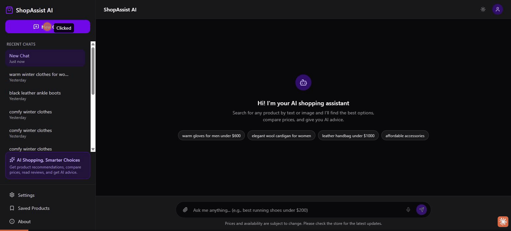
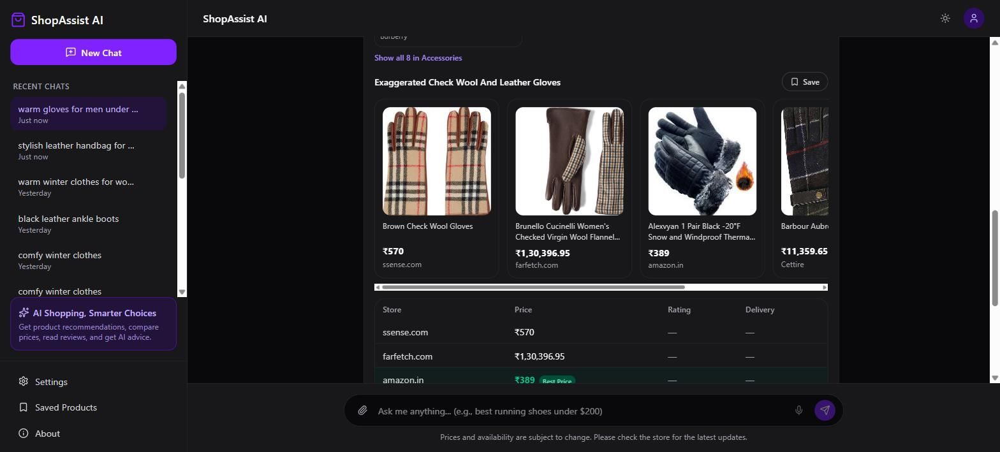
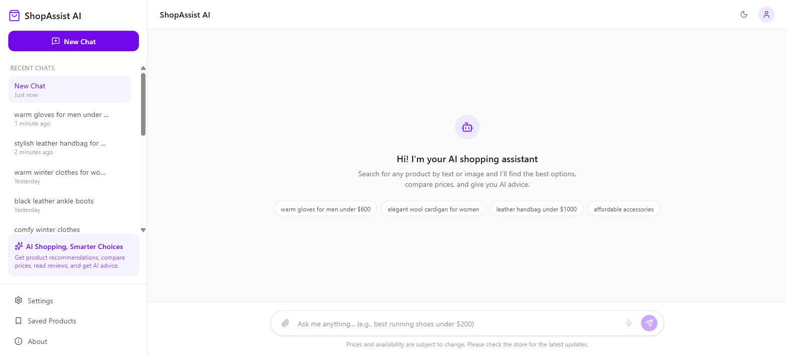
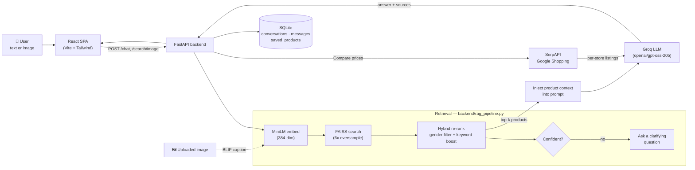

# 🛍️ ShopSense AI

**An AI shopping assistant that actually knows what it's looking at.**
Describe what you want — in words or with a photo — and it searches a
3,000+ product fashion catalog with real semantic understanding, answers
your questions like a knowledgeable friend, and hunts down the best live
price across the web. No keyword matching. No "0 results found." Just a
shopping copilot with a memory.

> *Branding note: the in-app UI header reads "ShopAssist AI" — same project, same repo, one product that outgrew its working title.*

<p align="center">
  
</p>

<p align="center">
  
  
  
  
  
  
</p>

---

## ✨ Why this exists

Most "AI shopping" demos are a chatbot bolted onto a search bar. ShopSense
AI is built the other way around: a real retrieval pipeline (FAISS over
sentence embeddings) decides what's actually relevant, and the LLM is only
ever allowed to talk about products that pipeline actually found. That
means:

- It won't confidently invent a product that doesn't exist.
- When your query is ambiguous ("gloves under $600" — men's or women's?),
  it **asks**, instead of guessing.
- It can look at a *photo* of a sneaker and find visually/semantically
  similar items in the catalog.
- "Compare prices" isn't a static field — it's a live SerpAPI lookup
  across Amazon, Flipkart, ssense, Farfetch, and more, at the moment you
  click it.

## 🎬 See it in action

| Chat with facet filters & price table | Live multi-store comparison |
|:---:|:---:|
|  |  |

<p align="center"></p>

## 🧠 How a query becomes an answer



**Retrieval, not vibes.** Every answer is grounded in whatever FAISS
actually retrieved from the 3,038-product catalog — the LLM summarizes
and advises, it doesn't invent inventory.

## 🚀 Feature tour

- **🔍 Semantic text search** — `all-MiniLM-L6-v2` embeddings + a FAISS
  `IndexFlatL2` index over 3,038 fashion products, oversampled 6x and
  hybrid re-ranked (hard gender filter + lexical keyword boost) before
  anything reaches the LLM.
- **🖼️ Image search** — drop in a JPEG/PNG, BLIP
  (`Salesforce/blip-image-captioning-base`) captions it, and the caption
  feeds straight into the same retrieval pipeline as a text query.
- **💬 Conversational answers** — Groq (`openai/gpt-oss-20b`) turns
  retrieved products into a real recommendation, with sources, follow-up
  awareness (last 6 turns), and clarifying questions when a query is
  ambiguous or under-confident.
- **💰 Live multi-store price comparison** — one click resolves the top
  match to live listings via SerpAPI's Google Shopping engine, ranks them,
  flags the best price, and asks the LLM to summarize the trade-offs. A
  24-hour JSON cache and graceful degradation mean a missing/expired API
  key never breaks the chat experience.
- **🔗 Real merchant links** — clicking a store card resolves SerpAPI's
  `google_immersive_product` engine to the actual retailer URL, not a
  Google redirect.
- **🗂️ Persistent history** — every conversation and message (with its
  sources, product cards, and clarifying-question state) is stored in
  SQLite, so chats survive a refresh.
- **⭐ Saved products** — bookmark anything from a result card or a price
  comparison and revisit it from the Saved Products page.
- **🌓 Light/dark mode, keyboard-friendly, fully typed** — a Tailwind v4
  React SPA with a typed API layer (custom `ApiRequestError`,
  `AbortController` timeouts) instead of `any`-typed fetch calls.

## 🏗️ Architecture

Two processes, one contract:

```
┌────────────────────────┐        HTTP / JSON        ┌──────────────────────────┐
│   React SPA (Vite)      │  ────────────────────────▶ │   FastAPI backend        │
│   http://127.0.0.1:5173 │  ◀──────────────────────── │   http://127.0.0.1:8000  │
└────────────────────────┘                             └──────────────────────────┘
                                                                    │
                     ┌───────────────────┬───────────────────┬─────┴──────────────┐
                     ▼                   ▼                   ▼                    ▼
              FAISS + MiniLM        BLIP captioning      Groq LLM            SerpAPI
              (semantic search)     (image → text)      (answers)      (live prices)
                     │
                     ▼
              SQLite (shopassist.db)
              conversations · messages · saved_products
```

A legacy Streamlit UI (`ui/app.py`) still lives in the repo from the
project's first iteration and talks to the same FastAPI backend — useful
if you want a zero-build way to poke at the API.

## 🧰 Tech stack

| Layer | Technology |
|---|---|
| Frontend | React 19 · TypeScript ~6.0 · Vite 8 · Tailwind CSS v4 · react-router-dom · react-markdown |
| API | FastAPI · Uvicorn · Pydantic v2 |
| Retrieval | sentence-transformers (`all-MiniLM-L6-v2`) · FAISS (`faiss-cpu`) |
| Multimodal | Transformers · BLIP image captioning · Torch · Pillow |
| Generative AI | Groq API (`openai/gpt-oss-20b`) |
| Live pricing | SerpAPI (Google Shopping + Immersive Product) |
| Persistence | SQLite (stdlib `sqlite3`) |
| Data pipeline | pandas · NumPy — curate → preprocess → embed → index |
| Eval | Custom retrieval harness — Precision@K, Recall@10, MRR, latency benchmark |
| Legacy UI | Streamlit |

<details>
<summary><strong>Full dependency list & request flows</strong> (click to expand)</summary>

See [`TECH_STACK.txt`](TECH_STACK.txt) for the exhaustive, versioned
breakdown of every dependency and the exact end-to-end request flow for
text chat, image chat, and price comparison.

</details>

## 📦 Project structure

```
ShopSense AI/
├── backend/
│   ├── main.py              # FastAPI app, all endpoints, lifespan model loading
│   ├── rag_pipeline.py       # FAISS search, hybrid re-rank, Groq prompting
│   ├── price_compare.py      # SerpAPI shopping + immersive-product resolution
│   ├── image_to_text.py      # BLIP captioning
│   ├── database.py           # SQLite schema + conversation/saved-product CRUD
│   ├── product_index.faiss   # Prebuilt FAISS index (3,038 vectors)
│   └── product_metadata.pkl  # Prebuilt product metadata
├── data_pipeline/             # 01_curate → 02_preprocess → 03_embed → 04_build_index
├── data/                      # Curated CSVs + embeddings backing the pipeline
├── eval/                      # Retrieval eval harness (precision/recall/MRR) + latency benchmark
├── ui/                        # Legacy Streamlit UI
├── frontend/
│   └── src/
│       ├── api/               # Typed fetch client, endpoints, types
│       ├── components/        # chat/, products/, layout/, common/
│       ├── hooks/              # useChat, useSavedProducts
│       ├── pages/              # Chat, Saved Products, Settings, About
│       └── context/            # ThemeContext, ConversationsContext
└── requirements.txt
```

## ⚡ Getting started

**Prerequisites:** Python 3.11+, Node.js 18+, a [Groq API key](https://console.groq.com/keys)
(free tier works), and optionally a [SerpAPI key](https://serpapi.com/) for
live price comparison — without it, everything works except the "Compare
prices" action, which degrades gracefully.

```bash
# 1. Clone and enter the repo
git clone https://github.com/suhani-chauhan/ShopSense-AI.git
cd ShopSense-AI

# 2. Python environment + backend deps
python -m venv venv
source venv/bin/activate        # Windows: venv\Scripts\Activate.ps1
pip install -r requirements.txt

# 3. Configure API keys
cp .env.example .env
# then edit .env and set GROQ_API_KEY (required) and SERPAPI_KEY (optional)

# 4. Frontend deps
cd frontend && npm install && cd ..
```

Run the backend and frontend in two terminals:

```bash
# Terminal 1 — FastAPI backend (models load on first request; give it ~30-60s)
uvicorn backend.main:app --reload --port 8000

# Terminal 2 — React frontend
cd frontend && npm run dev
```

Open **http://127.0.0.1:5173** and start chatting. First-time model
downloads (MiniLM + BLIP weights) may take a minute; the FAISS index and
product metadata are already committed, so there's no data-pipeline step
required for a first run.

> **Windows note:** the backend binds IPv4 only — prefer `127.0.0.1` over
> `localhost` in your browser and `curl` calls to avoid an IPv6 loopback
> stall on Windows.

<details>
<summary>Prefer the legacy Streamlit UI instead?</summary>

```bash
streamlit run ui/app.py
```

It talks to the same FastAPI backend over HTTP — start `uvicorn` first.

</details>

<details>
<summary>Rebuilding the product catalog from scratch</summary>

```bash
cd data_pipeline
python 01_curate.py
python 02_preprocess.py
python 03_build_embeddings.py
python 04_build_faiss_index.py
```

This regenerates `backend/product_index.faiss` and
`backend/product_metadata.pkl` from `data/`.

</details>

## 📡 API reference

All endpoints are served by the FastAPI backend at `http://127.0.0.1:8000`.

| Method | Endpoint | Purpose |
|---|---|---|
| `GET` | `/health` | Liveness + how many products are loaded |
| `POST` | `/search/text` | Raw FAISS search, no LLM |
| `POST` | `/search/image` | BLIP caption → FAISS search |
| `POST` | `/chat` | Full RAG answer for a text query |
| `POST` | `/chat/image` | Full RAG answer for an uploaded image |
| `POST` | `/chat/compare` | Resolve top match → live SerpAPI price comparison |
| `POST` | `/resolve-listing-link` | Turn a SerpAPI listing token into a real merchant URL |
| `POST /GET /DELETE` | `/conversations` | Create / list / fetch / delete chat history |
| `POST /GET /DELETE` | `/saved-products` | Save / list / remove bookmarked products |

## 📊 Evaluation

A hand-built retrieval harness lives in [`eval/`](eval/) — 15 representative
queries (specific, broad, price-constrained, gender/category-specific)
scored for Precision@5, Precision@10, Recall@10, and MRR against
hand-labeled relevance judgments, plus a latency benchmark:

| Endpoint | Avg latency |
|---|---|
| `POST /search/text` (raw retrieval) | ~0.03s |
| `POST /chat` (full RAG w/ Groq) | ~0.77s |

*(15 requests/endpoint against a local server — see
[`eval/latency_results.md`](eval/latency_results.md). Run
`python eval/generate_candidates.py && python eval/evaluate.py` to
reproduce the precision/recall/MRR numbers yourself.)*

## 🗺️ Roadmap ideas

- [ ] Swap the fixed Burberry-only catalog for a multi-brand dataset
- [ ] Streaming token-by-token responses instead of a single JSON payload
- [ ] User accounts so saved products/history aren't shared across all
      visitors of one SQLite file
- [ ] Dockerfile / docker-compose for a one-command spin-up
- [ ] Swap SQLite for Postgres if this ever needs to run multi-instance

## 🤝 Contributing

Issues and PRs are welcome — this is an active learning/portfolio project,
so expect the architecture to keep evolving. If you spot a retrieval edge
case (a query that should clarify but doesn't, or vice versa), open an
issue with the query text; it's the fastest way to improve
`rag_pipeline.py`'s heuristics.

## 📄 License

No license file is included yet — until one is added, all rights are
reserved by the author. Reach out if you'd like to use this beyond
reference/learning purposes.

---

<p align="center">Built with FAISS, BLIP, Groq, and a refusal to let an LLM make up a product that doesn't exist.</p>
